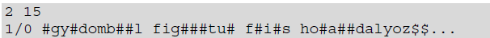
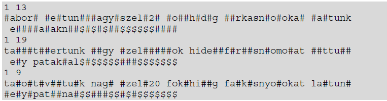
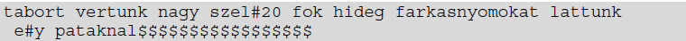

# Expedíció
Valamikor a távközlés hőskorában egy ritka farkasfaj tudományos megfigyelésére expedíciót szerveztek a sarkkörön túlra. A magukkal vitt rádió csak napi egy adásra volt alkalmas,  arra  is   csak   90   időegységig,   időegységenként   egy   karaktert   továbbítva. Az expedíció rádiósának üzeneteit több rádióamatőr is igyekezett lejegyezni. A feladatban a rádióamatőrök által lejegyzett üzeneteket kell feldolgoznia.
## A forrás fájl értelmezése
A `veetel.txt` fájl tartalmazza a rádióamatőrök által feljegyzett üzeneteket. Minden sorpár egy-egy feljegyzést tartalmaz.
- A sorpár első sorában két szám áll, az első a nap sorszáma, a második pedig – az előzőtől egy szóközzel elválasztva – a rádióamatőré.
- A sorpár második sorában a feljegyzéshez tartozó pontosan 90 karakter áll. A vett karakter az angol ábécé kisbetűje, számjegy, / jel vagy szóköz lehet. Ha az adott időegységben nem volt egyértelműen azonosítható a vett jel, akkor # karakter szerepel. Ha a tényleges üzenet befejeződött, az adó a fennmaradó időegységekben $ jelet küld.
- A napok sorszáma 1 és 11, a rádióamatőrök sorszáma 1 és 20 közötti egész szám lehet.
- Ha a megfigyelés során láttak farkasokat, akkor az üzenet két, / jellel elválasztott egész számmal, a látott kifejlett és kölyök egyedek számával kezdődik, amelyet szóköz követ. Más esetben nem szám az első karakter.
Például:

A fenti sorpár 
- első sora mutatja, hogy az üzenet a 2. napon érkezett és a 15-ös rádióamatőr rögzítette. 
- 1 felnőtt és 0 kölyök farkast figyeltek meg. Mivel a második sorban a 45. karakter $ jel, és előtte nem # jel szerepel, ezért az üzenet biztosan 44 karakter hosszú.

Példa a visszafejtésre:

Az első nap üzenetei:

Az ebből visszafejtett kód:

## A program feladata
1. Olvassa be veetel.txt fájlt feldogozható formában.

2. Fejtse vissza napok üzeneteit, mentsen el a `veetelMegfejtett.txt` fájlba. Ennek szerkezete:
- Egy sor egy nap
    - 1\. oszlop: a nap száma
    - 2\. oszlop: a visszafejtett üzenet
    - oszlop határoló: ;

3. Készítsen statisztikát arról, hogy melyik napon, hány üzenetet rögzítettek az amatőrök a `napiStatisztika.txt` fájlba.
    - 1\. oszlop: a nap száma
    - 2\. oszlop: hány amatőr vette az üzenetet
    - 3\. oszlop: hány felnőtt farkast láttak (ha nem láttak farkast: - jel legyen)
    - 4\. oszlop: hány gyerek farkast láttak (ha nem láttak farkast: - jel legyen)
    - oszlop határoló: ;

4. A program a képernyőn informálja a felhasználót, hogy melyik fájlba mi készült el.

