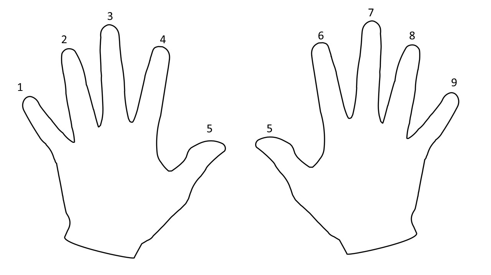

# Gépírás elemző
Készítsen egy asztali alkalmazást, ami a projekt mappájában elhelyezett szövegfájlt  (`szoveg.txt`) beolvassa, és a `fingerOrder.csv`  karakter - ujj megfeleltetés szöveges táblázat alapján a képernyőn százalékosan megjeleníti az ujjak terhelését. Ezzen túl készít egy `karakteradatgyujtes.txt` szöveges táblázatot, amiben adatgyűjtést találunk arról, hogy melyik karaktert melyik ujj hányszor nyomta le.

## Fájl értelmezések
### `fingerOrder.csv`
A karakter – ujj hozzárendelés táblázathoz ismerni kell a felülről nézett, tenyérrel lefordított ujjak számozását:

A szöveges táblázat részlete, értelmezése:

A táblázat pontosvesszővel elválasztott 3 oszlopból ál:
1. oszlop: karakter;
2. oszlop: valamelyik kéz ujjának száma
3. oszlop: hogy a másik kéz melyik ujja dolgozik. A 0 azt jelenti, hogy közben nem használunk ujjat.

pl.: `9;7;0` sor jelentése:, 9-es karaktert az 7-es ujj (jobb középső ujj) üti le, a 0 azt jelenti, hogy másik ujjra (kézre) nincs szükség, ugyanis pl. a nagybetűket két kézzel ütjük, az egyik kisujja (vagy a bal, vagy a jobb) mindig a Shift.

pl.: `+;2;9:` a + karaktert két kézzel ütjük: 2-es ujj (bal gyűrűs) 3-as billentyűt és 9-es ujj (jobb kisujj) a Shift-et nyomja le „kvázi egyszerre” (előbb a Shift !!!)

### `karakteradatgyujtes.txt` szerkezete
A  `karakteradatgyujtes.txt` egy csv táblázat, amiben adatgyűjtést készít a program arról, hogy melyik karaktert melyik ujj hányszor nyomta le.
Oszlopai: 
1. oszlop: karakter
2. oszlop: melyik kéz (bal, jobb)
3. oszlop: az ujj száma
4. oszlop: `karaterleütés-szám`: a karakter hányszor fordult elő a szövegben.

A táblázat oszlopelválasztója: ";"
A táblázat rendezése: `karaterleütés-szám` szerint csökkenőben.

## Hogy működjön a program
1. A program a prancssori paraméterben kapja meg a bemeneti szövegfájlt: `szoveg.txt`
    - ha a fájl nem létezik, kiírja ezt, és leáll

2. Elvégzi a statisztikai elemést és kiírja az ujjak százalékos és számszerű terhelését a képernyőre jól áttekinthető formában.

3. Elkészíti a `karakteradatgyujtes.txt` fájlt.

