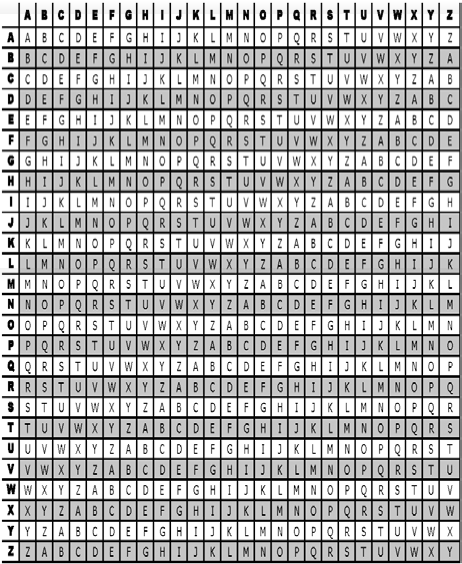
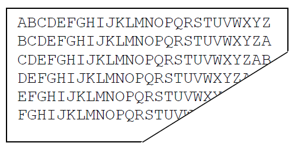
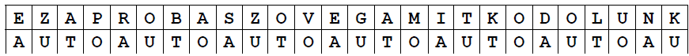
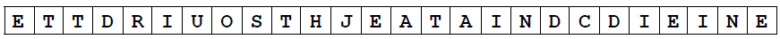

# Vigienere tábla

Már a XVI. században komoly titkosítási módszereket találtak ki az üzenetek elrejtésé- re. A század egyik legjobb kriptográfusának Blaise de Vigenère-nek a módszerét olvashatja a következőkben.

## A kódolás leírása
A kódoláshoz egy táblázatot és egy ún. kulcs- szót használt. A táblázatot az alábbi ábra tartalmazza:

A tábla adatait a `vtabla.dat` fájlban találja a következő formában:

Készítsen programot a következő feladatok végrehajtására!

1. Olvassa be a `nyiltSzöveg.txt` fájlból a maximum 255 karakternyi, nem üres szöveget! A továbbiakban ez a nyílt szöveg.
2. Alakítsa át a nyílt szöveget, hogy a későbbi kódolás feltételeinek megfeleljen! A kódolás feltételei:
  - A magyar ékezetes karakterek helyett ékezetmenteseket kell használni. (Például á helyett a; ő helyett o stb.)
  - A nyílt szövegben az átalakítás után csak az angol ábécé betűi szerepelhetnek.
  - A nyílt szöveg az átalakítás után legyen csupa nagybetűs.

3. Kérjen be a felhasználótól egy maximum 5 karakteres, nem üres `kulcsszót`! A kulcsszó a kódolás feltételeinek megfelelő legyen! (Sem átalakítás, sem ellenőrzés nem kell!) Alakítsa át a kulcsszót csupa nagybetűssé!
4. A kódolás első lépéseként fűzze össze a kulcsszót egymás után annyiszor, hogy az így kapott karaktersorozat (továbbiakban kulcsszöveg) hossza legyen egyenlő a kódolandó szöveg hosszával!
5. A kódolás második lépéseként a következőket hajtsa végre! Vegye az átalakított nyílt szöveg első karakterét, és keresse meg a vtabla.dat fájlból beolvasott táblázat első oszlopában! Ezután vegye a kulcsszöveg első karakterét, és keresse meg a táblázat első sorában! Az így kiválasztott sor és oszlop metszéspontjában lévő karakter lesz a kódolt szöveg első karaktere. Ezt ismételje a kódolandó szöveg többi karakterével is!
6. Írja ki a `kodolt.txt` fájlba a kapott kódolt szöveget!

## Példa a kódolásra:

Nyílt szöveg: Ez a próba szöveg, amit kódolunk! Szöveg átalakítása: EZAPROBASZOVEGAMITKODOLUNK Kulcsszó: auto

Kulcsszó nagybetűssé alakítása: AUTO

Nyílt szöveg és kulcsszöveg együtt:

Kódolt szöveg:
 

## A program hogy működjön
- A program képes legyen a `kodolt.txt` fájl visszafordítására a `kodoltMegfejtes.txt` fájlba.
- A programot írja meg úgy, hogy az képes legyen egy titkosított üzenetváltást használhatóan lekezelni. Ennek megoldási módja az ön feladata.